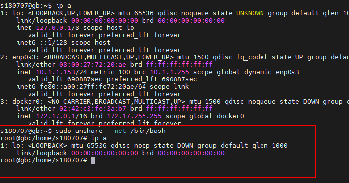
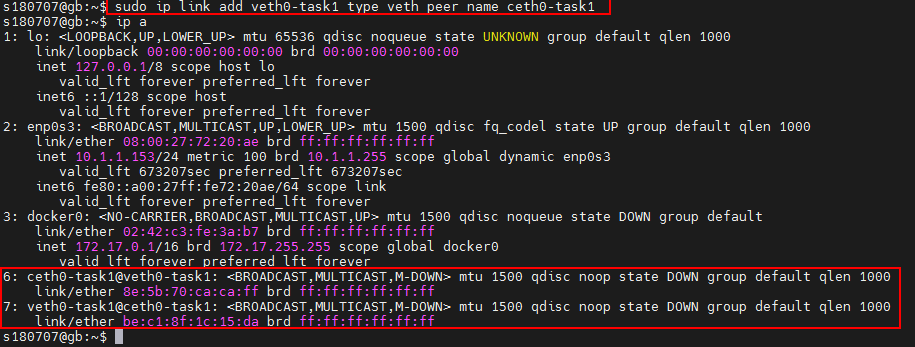

## Задача 1 Необходимо продемонстрировать изоляцию одного и того же приложения (как решено на семинаре - командного интерпретатора) в различных пространствах имен.

1.	Проверяем интерфейсы в корне: **ip a**

2.	Создаем сетевое пространство имен:  

**sudo unshare --net /bin/bash**

**sudo ip netns add netnstask1**

3.	Проверяем: **sudo nsenter --net=/var/run/netns/netnstask1 /bin/bash**

4.	Создаем виртуальные интерфейсы: **sudo ip link add veth0-task1 type veth peer name ceth0-task1**

5.	Помещаем ceth0-task1 в netnstask1: **sudo ip link set ceth0-task1 netns netnstask1**

6.	Включаем интерфейс veth0-task1: sudo ip link set veth0-task1 up
Присваиваем ip: **sudo ip addr add 10.0.0.1/24 dev veth0-task1**

7.	Переходим внутрь netnstask1: **sudo nsenter --net=/var/run/netns/netnstask1 /bin/bash**

    Включаем интерфейс lo: **ip link set lo up**

    Включаем интерфейс ceth0-task1:  **ip link set ceth0-task1 up**

8.	Присваиваем ip : **ip addr add 10.0.0.2/24 dev ceth0-task1**

9.	Проверяем: **ping 10.0.0.2**

10.	Проверяем: ping 10.0.0.1

