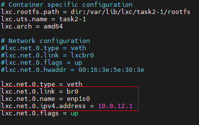

## Урок 3. Механизмы контрольных групп
----
### Задание 1

1.  Запустить контейнер с ubuntu, используя механизм LXC.
    * Смотрим список контейнеров: **lxc-ls –f**

        
    
    * Запускаем контейнер task2-1: **lxc-start -d -n task2-1**
        
        

2.	Ограничить контейнер 256 Мб ОЗУ и проверить, что ограничение работает.
    *   Открываем конфиг контейнера: **nano /var/lib/lxc/task2-1/config**

        

    *   Устанавливаем ограничение по памяти:  **lxc.cgroup2.memory.max = 256M**

        

    *   Перезапускаем контейнер, подключаемся к нему и смотрим количество выделенной памяти:
        *   **lxc-stop -n task2-1**
        *   **lxc-start -d -n task2-1**
        *   **lxc-attach -n task2-1**
        *   **free -m**

        

3.	Добавить автозапуск контейнеру, перезагрузить ОС и убедиться, что контейнер действительно запустился самостоятельно.
    *   Открываем конфиг контейнера: **nano /var/lib/lxc/task2-1/config**
    *   Устанавливаем автозапуск: **lxc.start.auto = 1**

        

    *   Перезапускаем контейнер и смотрим параметр автозапуска в списке контейнеров:
        *   **lxc-stop -n task2-1**
        *   **lxc-start -d -n task2-1**
        *	**lxc-ls -f**

        

    *	Останавливаем контейнер и перезагружаем Ubuntu

        

    *   После перезагрузки убеждаемся, что контейнер запустился самостоятельно

        

4.	При создании (запуске) указать файл, куда записывать логи:
    *	**lxc-start --logfile=/var/log/lxc.log -d -n task2-1**

        

5.	После перезагрузки проанализировать логи:
    *	Была попытка запустить уже запущенный контейнер
    
        

### Задание 2
Настроить автоматическую маршрутизацию между контейнерами. Адреса можно взять: 10.0.12.0/24 и 10.0.13.0/24.

1.	Создаем сетевой интерфейс типа bridge.
    *	**nano /etc/netplan/00-installer-config.yaml**

        

    *	**netplan apply**

        

2.	Создадим контейнеры.
    *	**lxc-create -n task2-1 -t ubuntu**
    *	**lxc-create -n task2-2 -t ubuntu**

        

3.	Сконфигурируем контейнер task2-1
    *	**nano /var/lib/lxc/task2-1/config**
        
        

4.	Сконфигурируем контейнер task2-2
    *	**nano /var/lib/lxc/task2-2/config**

        

5.	Запустим контейнеры
    *	**lxc-start -d -n task2-1**
    *	**lxc-start -d -n task2-2**

        

6.	Проверяем 
    *	**lxc-attach -n task2-1**

        

    *	**lxc-attach -n task2-2**

        