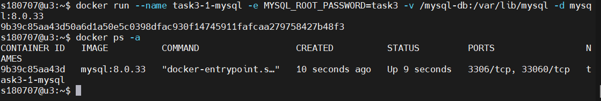
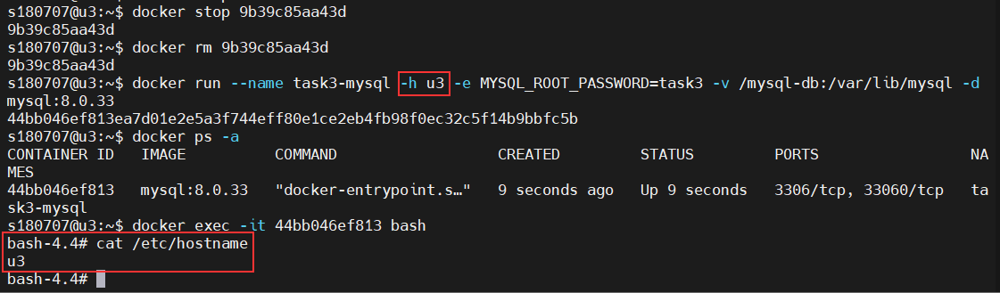
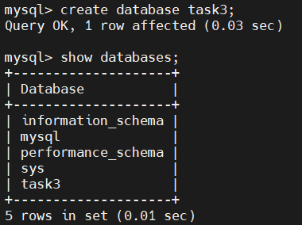
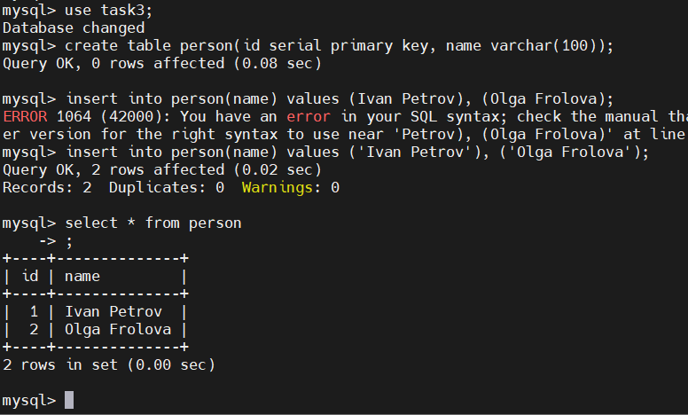
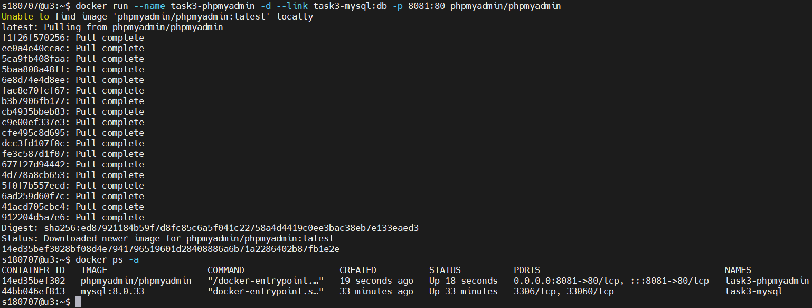
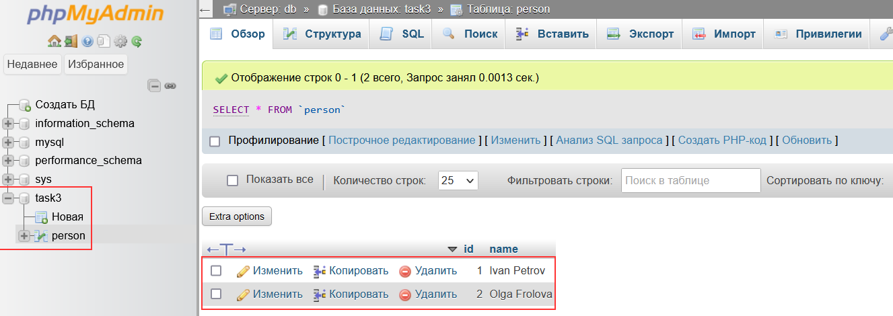

## Урок 3. Введение в Docker
1.	Запустить контейнер с БД, отличной от mariaDB.   
* docker run --name task3-1-mysql -e MYSQL_ROOT_PASSWORD=task3 -v /mysql-db:/var/lib/mysql -d mysql:8.0.33

2.	Добавить в контейнер hostname такой же, как hostname системы через переменную.
* docker run --name task3-mysql -h u3 -e MYSQL_ROOT_PASSWORD=task3 -v /mysql-db:/var/lib/mysql -d mysql:8.0.33

3.	Заполнить БД данными через консоль.
* mysql -u root -p
* create database task3;
* show databases;

* use task3;
* create table person(id serial primary key, name varchar(100));
* insert into person(name) values ('Ivan Petrov'), ('Olga Frolova');
* select * from person;

4.	Запустить phpmyadmin (в контейнере) и через веб проверить, что все введенные данные доступны.
* docker run --name task3-phpmyadmin -d --link task3-mysql:db -p 8081:80 phpmyadmin/phpmyadmin

* http://192.168.3.25:8081/index.php?route=/sql&pos=0&db=task3&table=person

