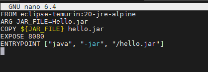
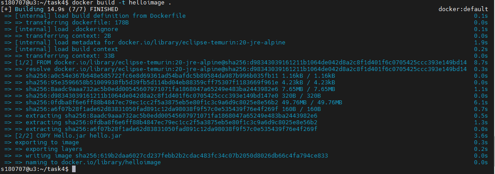
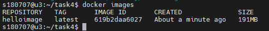
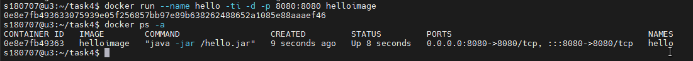
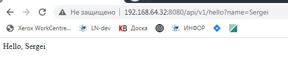
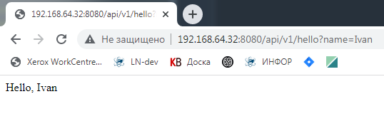

## Урок 4: Dockerfile и слои
---
### Задание
* Необходимо создать Dockerfile, основанный на любом образе (вы в праве выбрать самостоятельно).
* В него необходимо поместить приложение, написанное на любом известном вам языке программирования (Python, Java, C, С#, C++).

* При запуске контейнера должно запускаться самостоятельно написанное приложение.

---

1. Подготавливаем приложение **Hello.jar**, написанное на Java. Приложение представляет из себя REST WEB сервис.  

2. Создаем Dockerfile:

    

3. Собираем образ:
    * **docker build -t helloimage .**

    

    

4.	Запускаем контейнер
    *	**docker run --name hello -ti -d -p 8080:8080 helloimage**

    

5.	Проверяем
    *	**http://192.168.64.32:8080/api/v1/hello?name=Sergei**

    

    *   **http://192.168.64.32:8080/api/v1/hello?name=Ivan**
    
    