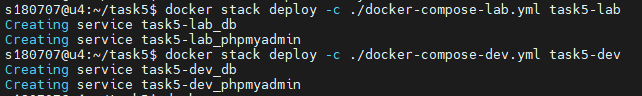
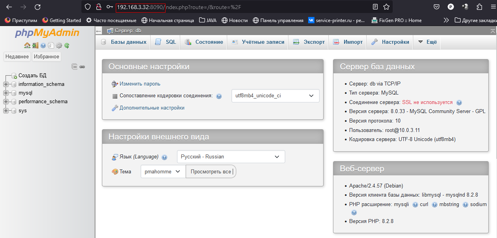

## Урок 5. Docker Compose и Docker Swarm
---
### Задание 1:
1.	Создать сервис, состоящий из 2 различных контейнеров: 1 - веб, 2 – БД
    *   Создаем docker-compose.yml: **nano docker-compose.yml**

        

    *   Запускаем docker-compose: **docker compose up -d**

        

    *   проверяем: **http://192.168.3.24:8080**

        

2.	Необходимо создать сервис так, чтобы на только ноде dev запускалось два контейнера.
    *   Инициализируем docker swarm на u3:  **docker swarm init** 
    *   Присоединяем ноду u4: **docker swarm join --token SWMTKN-1-2q7lbb85g5d0m8cwlntzz4u9cgv8cziyych5g7ll31tqluv3r9-bjkf0e0knezrdqg02stdnff6t 192.168.64.32:2377**

        

        

    *   Добавляем метку “dev” на ноду u4: **docker node update --label-add env=dev 95wg2oqazpp9r2c4lslzaaygk**

        

    *   Создаем сервис с двумя контейнерами на ноде “dev” (u4):  **docker service create --name mysql_service --constraint node.labels.env==dev --replicas 2 -e MYSQL_ROOT_PASSWORD=12345678 -p 3306:3306 mysql:8.0.33**

        

        

----
### Задание 2:
1.	Нужно создать 2 ДК-файла, в которых будут описываться сервисы
2.	Повторить задание 1 для двух окружений: lab, dev
3.	Обязательно проверить и зафиксировать результаты, чтобы можно было выслать преподавателю для проверки

    *   Инициализируем docker swarm на u4:  **docker swarm init**

        

    *   Присоединяем ноду u3: **docker swarm join --token SWMTKN-1-09de5xka6hh5redsnhc0z7p5qmjtlcbsbfr245h5iuj0gd56eq-8id6n27stpn5q368vb17fpndo 192.168.3.32:2377**

        

        

    *   Добавляем метку “dev” на ноду u3: **docker node update --label-add env=dev 0526pwahxo52u6cbnoqc5vr6m**

        

    *   Добавляем метку “lab” на ноду u4: **docker node update --label-add env=lab stdcn1q2wkyerr1mpgjpdmrtg**

        
        
    *   Создаем docker-compose.yml для lab: **nano docker-compose-lab.yml**

        

    *   Создаем docker-compose.yml для dev: **nano docker-compose-dev.yml**

        

    *   Развертываем:
        *   docker stack deploy -c ./docker-compose-lab.yml task5-lab
        *   docker stack deploy -c ./docker-compose-lab.yml task5-dev

        

    *   Проверяем

        

        

        

        

        

        